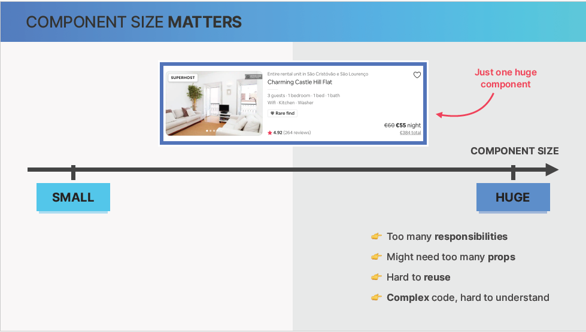
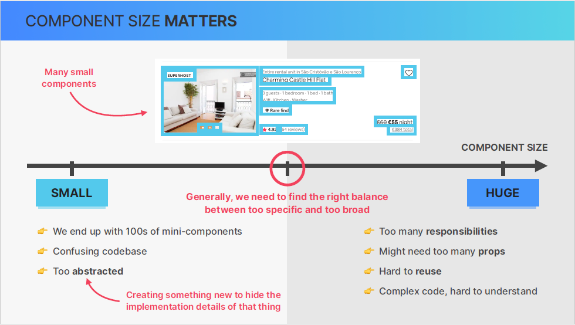
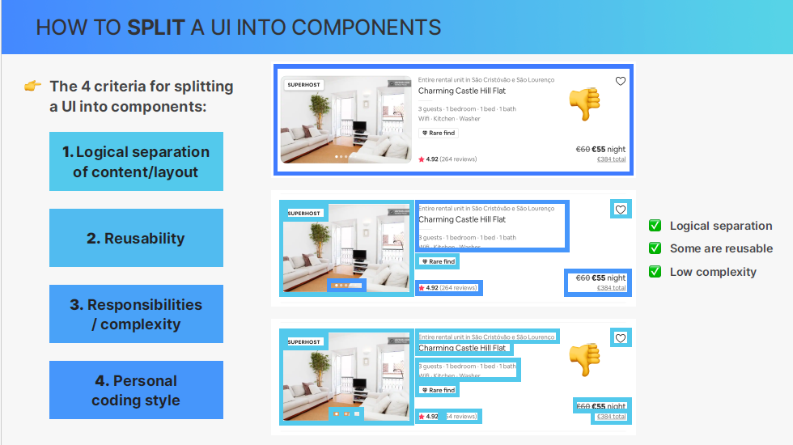
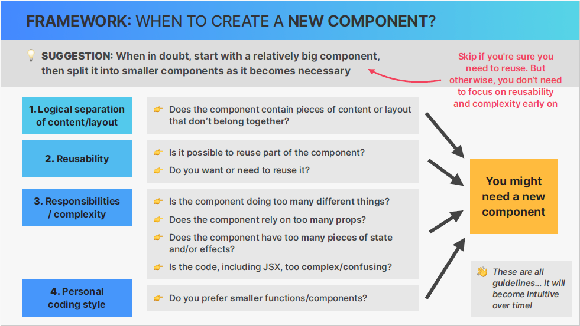
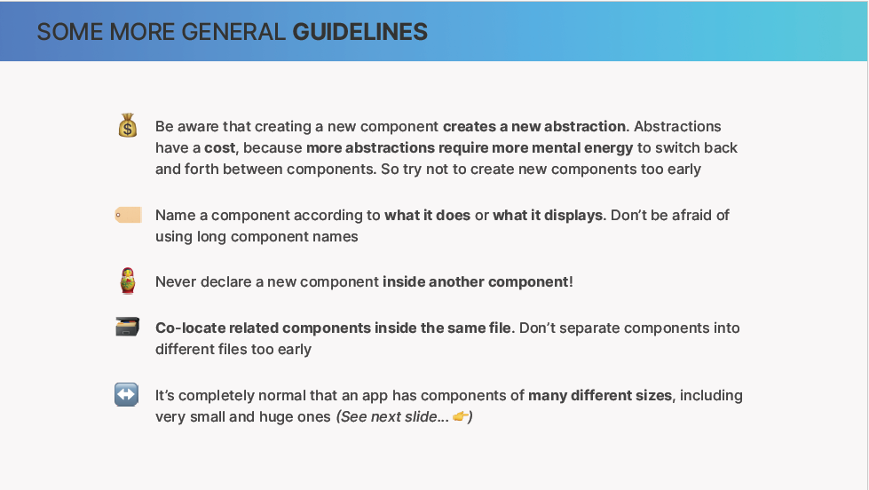
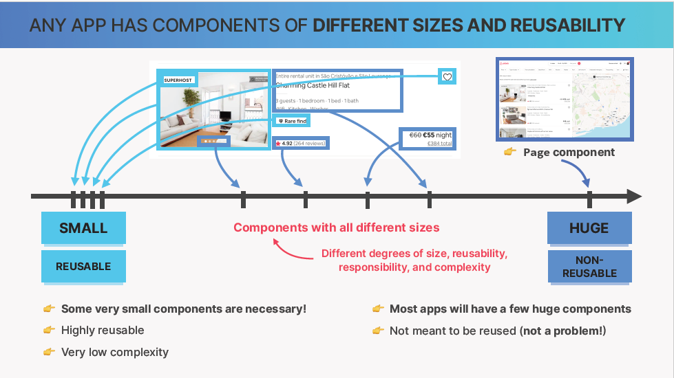
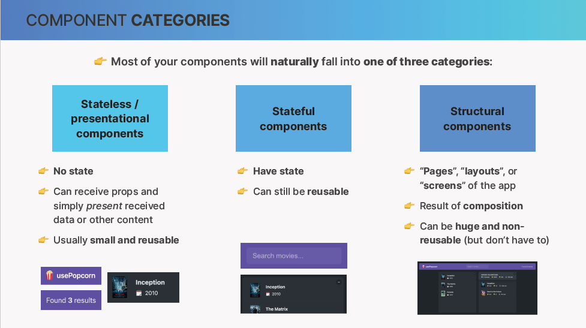
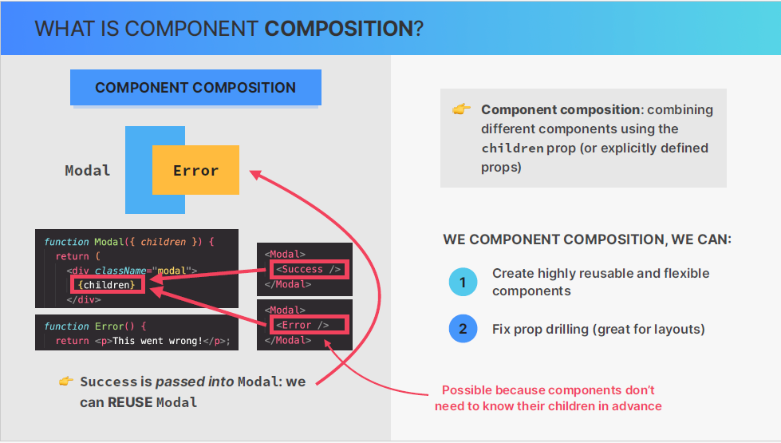
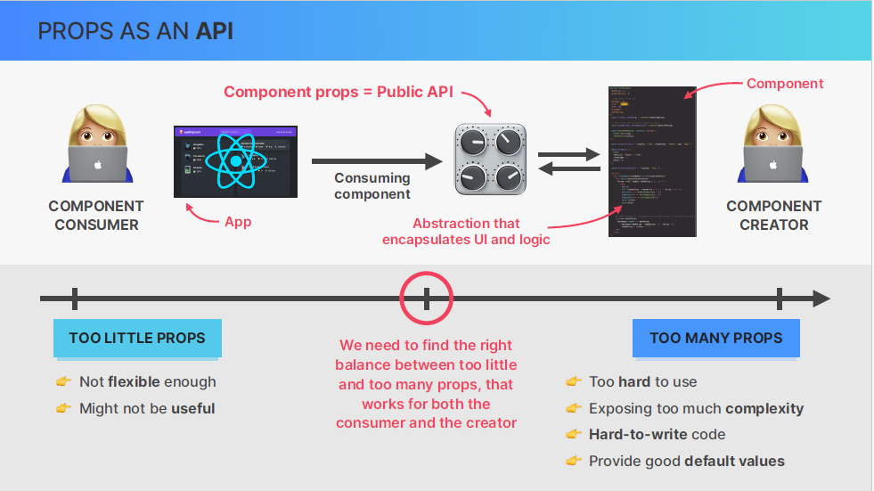

# Overview

This time is going to be how to think components, composition, and reusability

# Lesson II (Setting up a new project called use popcorn)

Just an abstraction about the project that we are going to build

# How to split a UI into component

Q ) How to split a UI into component and when should we create a new component ?

one way ) is by looking at component size so we can classify every component based on its size, which means that we can place every component on axis of component size.



at many times, none of these extremes(huge or small) are ideal.

imagine that we want to build this simple card in the picture.

- one way of building would be create just one huge componenet for the entire card. ( that will create a whole set of problems [first, there is way too much stuff going on in this component, so it has way too many responsibilities ], [second, the component is too large when it receives too many props in order to work properly ] ). so in general these two problems make it too hard to reuse the component which is the advantage of components in the first place.

Does that mean we should use the opposite and create many small components like this one on the left side

- another way (create many small components) / that would probably also a big terrible idea as well.
  if we would build a UI for the entire app in this way we would end up with 100 or 1000 of components, Too abstracted, confusing codebase.



So most of the times, the goal is to create components that strike the right balance between being too specific and too board (Large and small)



- prefer coding style / as you like some people just prefer larger component and some people prefer smaller component. so create the component in a way that works best for you so that you can stay as productive as possible.

#### Let's actually dig a bit deeper in these criteria

Something like a framework that helps create a new components from bigger components.

- the idea when you're creating a new component and you're in doubt about what the component should include, just start with relatively big component and then split this bigger component into smaller components as it becomes necessary.
  So when does it become necessary ?
  there are 4 criteria comes into play again in this pic :-



#### A few more general guidelines





## Componenet Categories



naturally because we shouldn't force our compoenents into one of these categories.

## Props Drilling

in the project.

## Component Composition




## Fixing Prop drilling with composition

in the project [here](./usepopcorn/src/App.tsx)

## Using composition to make a reusable box

in code [here](./usepopcorn//src/App.tsx)

## Passing Elements as props alternative to children

```
  <Box element={<ListMovies movies={movies} />} />
```

it is an alternative way to children but children way is preferable so we keep it in the code

## Creating a star component

[link on codesandbox](https://qn7ljr.csb.app/)

## Props as component API

When we build a reusable component like the one we built [here](https://qn7ljr.csb.app/) we should carefully think about what props the component needs.

So let's now shortly look at how to think about props.

So first of all, as we starting on our component, we should get into the mindset that any component is always created by someone, and always consumed by someone. so think in terms of there being a creator and consumer of a component, so different entities, even if it's just yourself.

So basically the creator is the person building a component, and defining what props the component can accept. While the consumer uses the component somewhere in the application by specifying values for the props.

Now the reason for separation between creator and consumer, even if you're just working on your own, is that if we have this mindset, we can think of the component props as the public API of the component.
So as a component creator / when we choose what props the consumer is allowed to pass in, we are essentially defining the public interface for our component and, at the same time, we're choosing how much complexity of the component we want to expose to the consumer of the API because the component is basically just an abstraction. so we're encapsulating a part of the UI and associated logic into a component, and allow consumers to interact with that component via props.

when we decide about what props to allow in a component, we need to find a good balance on how strict we want to be. so about how many props we want to enable for configuration as in picture 👇



## Improving reusability with props

we're going to make our component really flexible and reusable by defining a nice public api for consumers to use it.
so right now our component is quite unflexible [here](https://qn7ljr.csb.app/) and therefore, not really reusable.
so if we imagine that we want to reuse the component in many other applications or may be even publish it to NPM to share it with all react developers around the world, then they will probably not find this component very useful right now. So , those developers or in other words, those consumers, they will probably want to define things like ( the colors of the start or maybe the sizes of the stars and text ) in order to make this component fit into their own applications and so what we're going to do now is to try to define a good public api for this component just as we learned before. And so, by doing that, we will try to find that balance of using too few props and using too little props so that the component also doesn't get way too complex.

now look at the difference between [the new version](https://codesandbox.io/p/sandbox/reusable-star-component-the-new-version-8lztnq?file=%2Fsrc%2FApp.js) that is reusable and the old version that only the creator can benefit [old version](https://qn7ljr.csb.app/)
