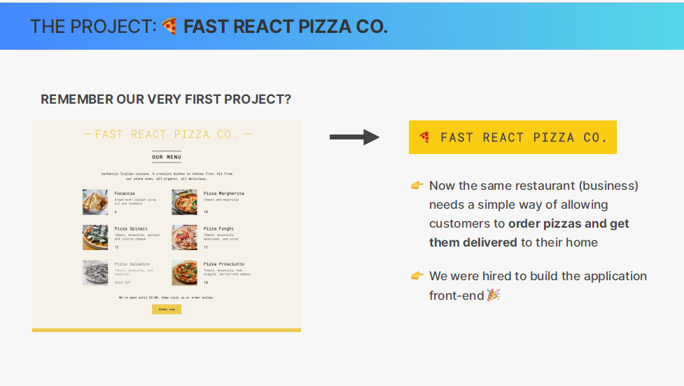
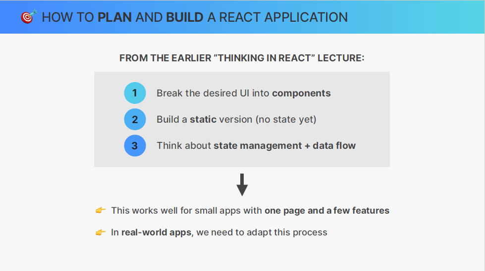
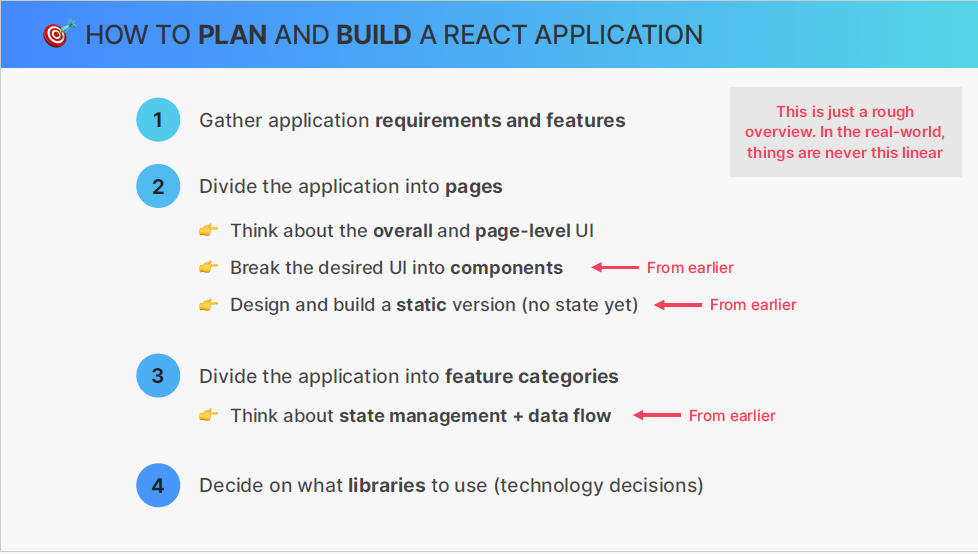
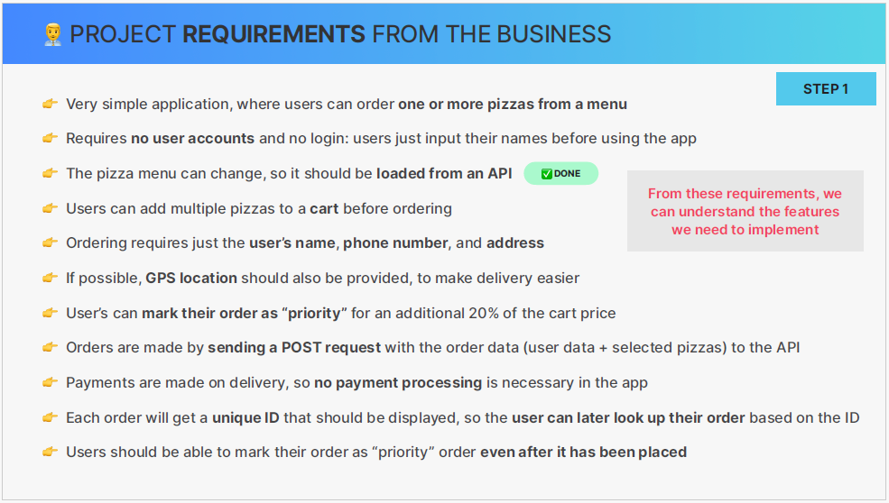
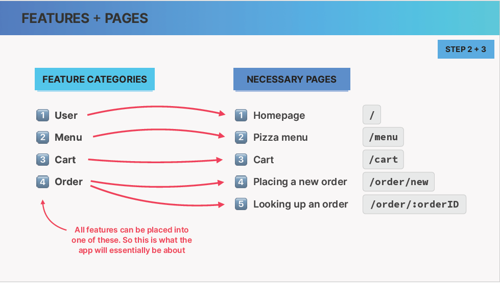
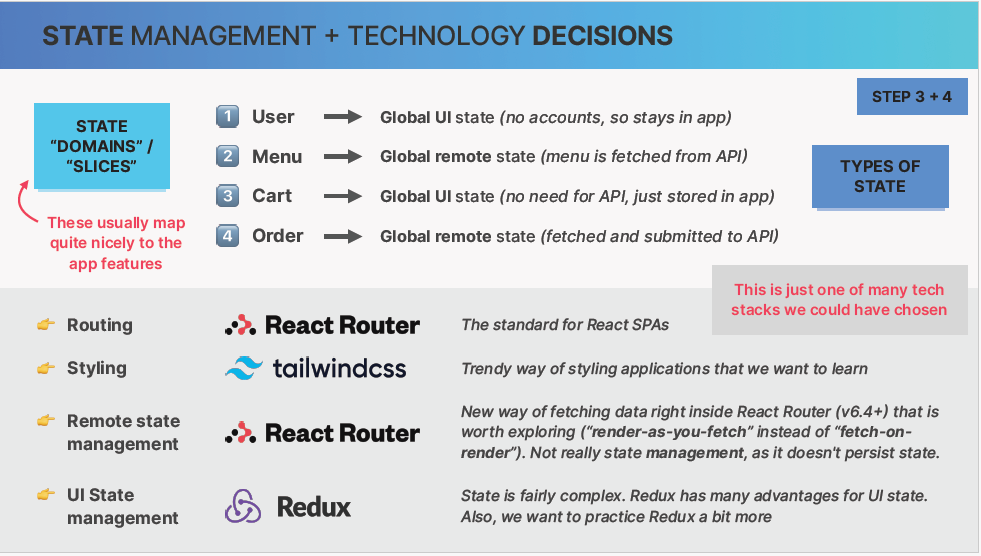

# React Router with data loading

## lesson 1 ( intro )

- in this first project we're gonna go back to react router and in particular, we're gonna make use of the modern data loading capabilities of react router in this really cool pizza ordering project. we'll also talk about how to actually plan a professional React project which is something that we haven't done in all previous projects so this time we're actually getting a bit more serious.

## lesson 2 ( Setting up a new project "Fast React Pizza Co." )

setting the app with vite and set eslint

## lesson 3 ( Application Planning )

- How we can plan a professional react application for a real client step by step but before we do that let's introduce our new fictional client

- we are going to do that using react. So for some reason they already have the backend api built, and so our only job will be to build the frontend ( the visible part of this application )

Now, building a complete application like this from scratch is of course a bit intimidating and so let's learn how we can break this process into multiple steps.

Let's actually start from what we learned earlier in [Thinking in react lecture](../sec-07-Thinking-In-React-state_management/)

- we can build simple react project by 👇🏾

Let's see how can we adapt it a little bit.
So when we build a large and more real world application we need to start by

from ☝🏾 number (3) we basically need to place all the features into a few categories, so that we can then build the application around those and so that we can organize our code in a logical way

number (4) called the technology decision

#### this is just a rough overview, so in the real world, things are never this linear but still this is a good overview

Let's now quickly go through these four steps here one by one and apply them to the application that we're gonna build and we're gonna start with ( business requirements ) so basically with everything that the business expects from this application

so this is the list of requirements that our application will need to satisfy but of course this is still a bit confusing so we don't really know how to build our application just from this, how ever from these requirements we can understand what features we actually need to implement and so let's take a look

what we want to do now is to derive the application's main features categories from the list of requirement that we just saw so first of all, remember how the user needs to input their name in order to start using the application so
<u>one feature categore</u> is going to be everything related to the user.
<u>Another pretty obvious categorey is </u> the menu
<u>Another pretty obvious categorey is </u> the cart
<u>Finally one of the big feature categories is </u> the order

- This will give us a high level overview of what the project is all about

- Now from this list of requirements and also specially from these feature categories, we can already start to understand the pages that we are going to need to implement.

(look at the pic 👆🏾)

This will all become a lot clearer as we actually start building this project in practice.

- Now moving on in this process let's talk about state mangement and tech decision

based on the first part of the pic we will decide which technology stack we will use so we decided to use the second part of the pic 👆🏾

## lesson 4 ( Setting up a professinal file structure )

There are many different ways in which we can structure a professional react application and every developer has a different opinion about this.

(Opinion) I like to do, and what I find works really really well with big projects is a feature based structure so instead of creating one big folder which contains all the components, instead what I like to do is to create on feature folder so right inside source let's create a folder called features and in it we will create folder for each feature ( User - Cart - Menu - Order )
and each feature will contain all the components, all the custom hooks, and really all typescript files that are necessary to make each of the feature work.
So all these files are going to be co-located in the same plcace so that we don't have to jump around all the time inside our folder structure.
However, there are also some components that are more reusable that don't really belong in any of these features.
and for that, let's create one folder called UI. And so this will basically contain reusable UI components such as buttons, inputs and so on.

Now next up, let's create the services folder. it is for reusable code for interacting with an API.

Let's keep going and add one for utilities and so these are basically just some helper functions that we can also reuse in multiple places in the application. so these are reusable and more importantly, stateless helper functions that don't create any side effects.

we could keep going here and we would do that if we had a more complex app for example, we could create a reusable context folder or a reusable hooks folder or also a pages folder like we did before in a world wise app but here in this app we will not have that special folder and instead we also place these pages in the feature folders.

## lesson 5 ( A new way of implementing routes )

React version 6.4 introduced a whole new way of defining routes and of working with React Router.
so from now on we can use some powerful mechanisms inside React Router <u>for fetching data into pages and submitting data using forms, so all within react router.</u>
look at the code [here](./fast-react-pizza/src/App.tsx)

## lesson 6 ( Building app layout )

implement a global application layout with react router

## lesson 7 ( Fetching Data with react router "Loaders": Pizza Menu )

The idea behind the loader is that somewhere in our code we create a function that fetches some data from an API, we then provide that loader function to one of our routes and that route will then fetch that data as soon as the application goes to that route and then at the end once the data has arrived, it will be provided to the page component itself using a custom hook.
Again, we do this in three steps:
1- we create the loader
2- we provide the loader
3- we provide the data to the page

look at the code [here](./fast-react-pizza/src/App.tsx)

the nice thing about this is that React Router will actually start fetching the data at the same time as it starts rendering the correct route. So these things really happen at the same time, while what we did before using useEffect was always a fetch on render approach. so basically we render the component first, and we then would start to fetch the data. and so that would then create so-called data loading waterfalls, but not here. so here everything really happens at the same time, which is a really nice and really modern things to do.

## lesson 8 ( displaying a loading indicator )

There is a delay between a click on loader event and data arriving, so during that time we of course want to display a spinner, so we want to know whether these data is loading or not and we don't have this loading state.
we can get access to this information by <u>useNavigation</u> hook in react router. And this actually for the entire application not for page but the entire router.
So if one of this pages is loading, the navigation state will become loading no matter which of these pages actually being loaded.
Therefore, it doesn't make much sense to create the loader right here (in specific component) but instead we will make one generic loader (in AppLayout file) [here](./fast-react-pizza/src/ui/AppLayout.tsx).

## Questions

1. when I used vite I get some options ( typescript , typescript with swc, js , js with swc ) what does that mean

ans) I'd be glad to explain the options you see when using Vite for project setup, specifically regarding TypeScript (TS) and SWC:

Vite and Project Setup

Vite is a popular frontend build tool known for its blazing-fast development experience. It leverages native browser features like ES modules for direct import in development, eliminating the need for a bundler in this phase. However, for production builds, Vite still needs to bundle your code for compatibility with older browsers.

Understanding the Options

When setting up a new Vite project, you'll encounter options related to your preferred language and transpiler:

TypeScript (TS): A superset of JavaScript that adds static typing for improved code safety, maintainability, and tooling support. It's a popular choice for large-scale or complex projects.
JavaScript (JS): The traditional scripting language for web development. Vite can handle plain JS files directly.
SWC: Stands for "Speedy Web Compiler." It's a fast and Rust-based JavaScript/TypeScript transpiler that can be used with Vite as an alternative to Babel.
The Offered Choices

Here's a breakdown of the specific options you see:

TypeScript: This option sets up your project for using TypeScript. Vite will automatically transpile your TS code into vanilla JavaScript during the build process.
TypeScript with SWC: Similar to the first option, but it uses SWC for transpiling instead of the default Babel. SWC often offers faster transpilation times, especially for large projects.
JavaScript: This option is for pure JavaScript projects. No transpilation is needed in development, and Vite will bundle the JS files directly for production.
JavaScript with SWC: This option is for JS projects that want to leverage SWC's potential performance benefits for building the production bundle.
Choosing the Right Option

The best option for you depends on your project's requirements:

TypeScript Enthusiast: If you prefer the safety and tooling benefits of TypeScript, choose either option 1 (Babel) or 2 (SWC) based on your preference for transpilation speed.
Vanilla JavaScript Project: If you're comfortable with plain JavaScript, opt for option 3 (plain JS) for a more streamlined setup. Consider option 4 (JS with SWC) if you want to explore SWC for faster builds.
Additional Considerations

Existing Project Type: If you're converting an existing project, the choice depends on whether it's already using TypeScript.
Community Support and Plugins: Both Babel and SWC have active communities and plugins. Research which one aligns better with your project's needs or future plans.
I hope this comprehensive explanation helps you make an informed decision when setting up your Vite project!

2. so here we used swc to get it fast

You're absolutely right! When setting up your Vite project with the "TypeScript with SWC" or "JavaScript with SWC" option, you're choosing performance as a key priority. SWC excels in offering faster transpilation times compared to Babel, especially for larger projects.

Here's a quick recap:

SWC: A fast and Rust-based JavaScript/TypeScript transpiler.
Babel: A more established JavaScript/TypeScript transpiler with a vast ecosystem of plugins, but potentially slower transpilation speed.
While Babel has a wider range of plugins, SWC is catching up rapidly. If your project doesn't require any specific plugins that are exclusive to Babel, then SWC is a great choice for a speedier development experience in Vite.

Here are some additional points to consider:

Project Size: If you anticipate your project growing significantly in the future, SWC's speed advantage becomes even more valuable.
Community and Resources: Babel has a more mature community and broader documentation, but SWC's community is growing quickly as well. You can always explore both options and see which one feels more comfortable for you.
Ultimately, the choice between SWC and Babel depends on your specific needs and preferences. By understanding their strengths and weaknesses, you can make an informed decision for your project's setup within the fast-paced environment of Vite.

3. so if the swc is fast why didn't it chosen automatically because it is best

There are a few reasons why SWC isn't the default transpiler in Vite, even though it offers faster speeds:

Maturity and Stability: While SWC is a promising project, Babel has been around for a much longer time and has a more established track record. This means Babel has likely encountered and addressed more edge cases and potential compatibility issues.

Plugin Ecosystem: Babel has a much larger ecosystem of plugins available. These plugins provide additional functionalities beyond basic transpilation, like supporting specific frameworks or libraries. If your project relies on a non-standard feature or library, there might be a Babel plugin that handles it, while SWC might not have a similar option yet.

Backward Compatibility: Vite aims to cater to a wide range of project requirements, including those that might have dependencies or workflows built around Babel. Making SWC the default could potentially cause compatibility issues with existing projects or tools that rely on Babel's specific behavior.

Community and Adoption: Babel has a much larger and more established community. This means there's a wider range of resources, tutorials, and troubleshooting guides available for Babel. While SWC's community is growing, it might still be easier to find help with Babel-related issues.

Balancing Speed and Stability: While speed is crucial, stability is equally important. Vite might prioritize the stability and broader compatibility of Babel by default, ensuring a smooth experience for a wider range of users. However, Vite provides the option of choosing SWC for projects that value speed above all else.

In summary, while SWC offers undeniable performance advantages, Vite considers a balance of various factors. By making Babel the default, Vite ensures a more predictable and well-supported experience for a broader audience, while still offering SWC as an option for those who prioritize speed.

## vocabularies

intimidating -> مخيف
rough overview -> نظرة عامة تقريبية
controversial part -> جزء مثير للجدل
persist state -> بقاء state
idle -> عاطل
