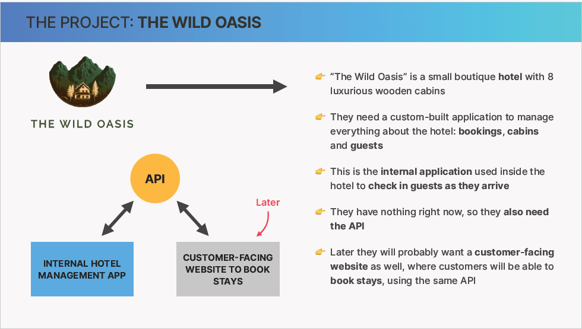
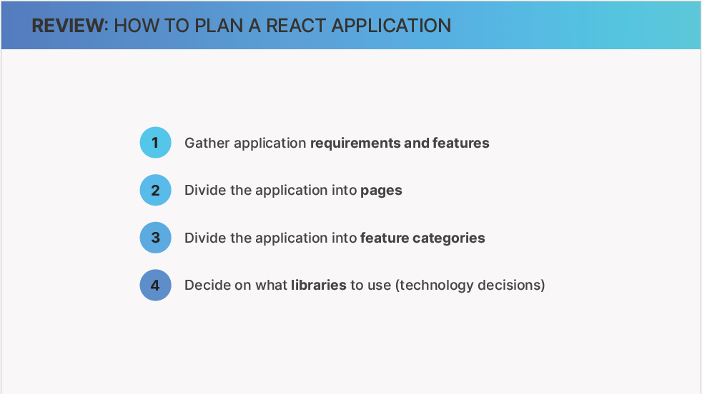
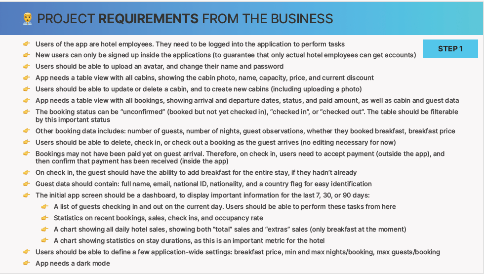
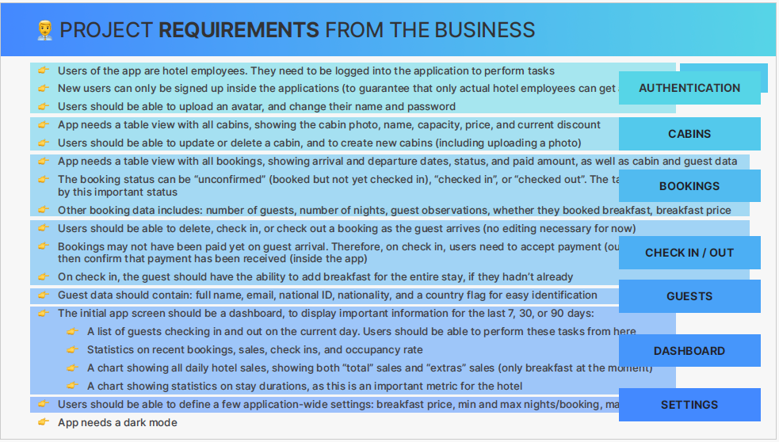
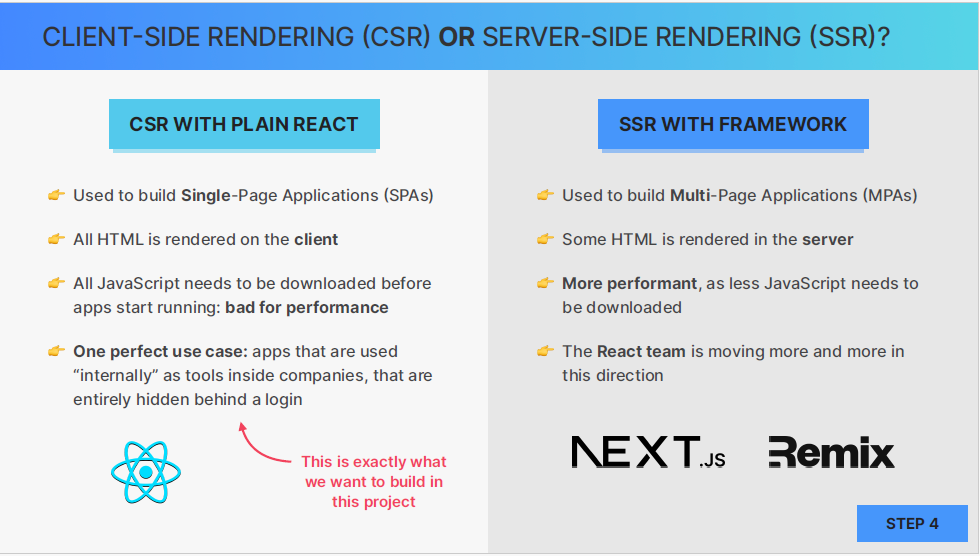
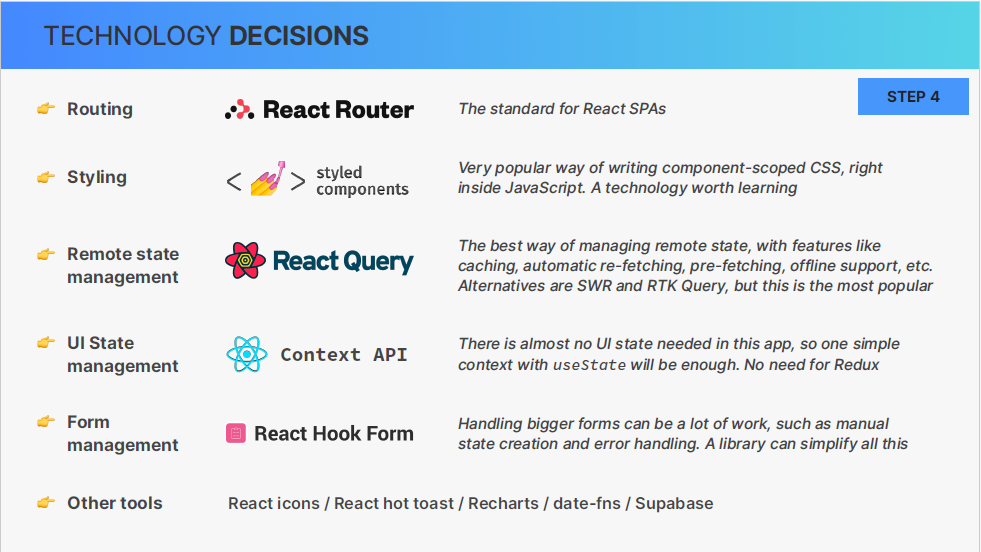
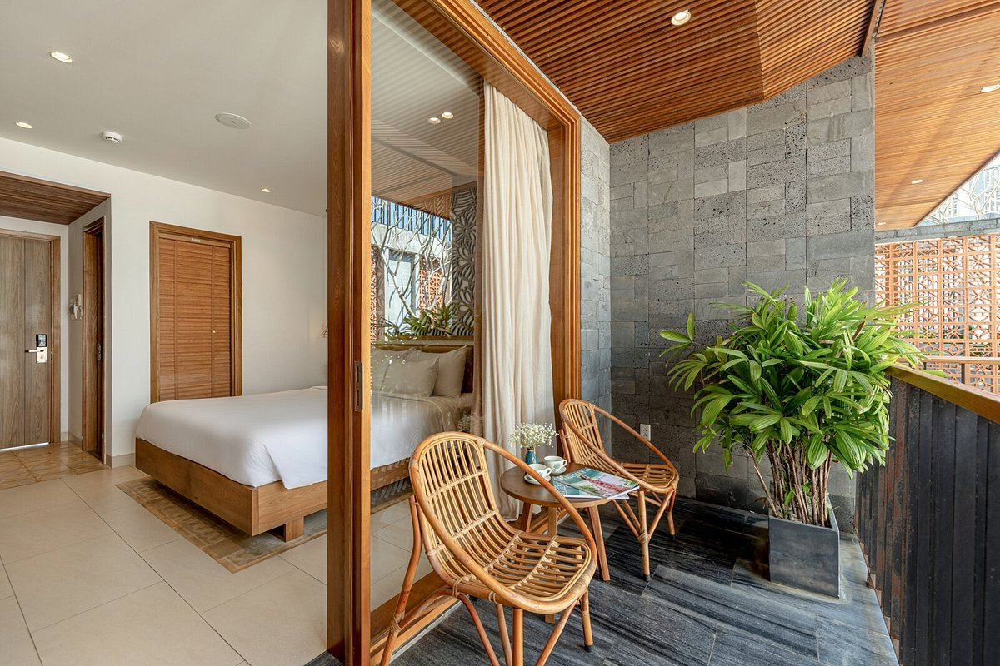
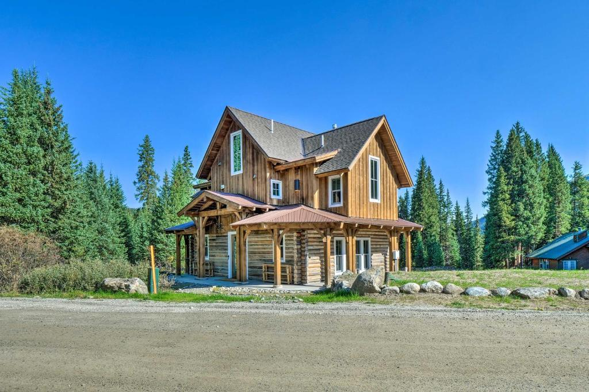

## Real World biggest project

In the next few sections together we'll plan and build the stunnig project using many professional
libraries from the react ecosystem such as style components, react query, react hook forms,
and react router again. We'll even setup our own backend with a complete database from scratch
using an amazing service called super base.

Let's get started by setting the project up and begin with style components.

## Application Planning

Let's start the project by first learning about the business and the requirements, and the planning out the entire application.

so we're gonna build an app for a small boutique hotel caled "The Wild Oasis" which features eight
luxurious wooden cabin so what they need us to do is to build custom application

- where they can manage everything about their hotel so ( the bookings, the cabins, and also the guests) and so this is basically an internal application that this business will use inside the hotel to check in the guests as they arrive

#### Let's start planning it very quickly

- Just a review what we learned earlier, this how we can plan a React, or really any other application

so these are requirements

we will now group these requirements into some feature categories

Let's move on and group these feature groups into some pages

Let's now talk about tech stack so before we talk about this let's talk about the difference between CSR an SSR

and now for tech stack

### Question

Q) What is boutique hotel

A) الفندق البوتيكي هو فندق صغير الحجم يقدم خدمات شخصية أكثر من الفنادق التقليدية. يحتوي عادةً على أقل من مائة غرفة، ويعتبر أكثر "عصرية"، غالبًا بسبب موقعه في المناطق الحضرية. قد تكون ذات طابع خاص، مثل التركيز على الطبيعة أو البيئة أو المطبخ أو التاريخ أو الانغماس المجتمعي والثقافي أو الخدمة اليقظة أو الرفاهية.

Q) What is eight luxurious wooden cabin مكون من 8 قطع كابينة خشبية فاخرة

### Vocabularies

departure dates مواعيد المغادرة
