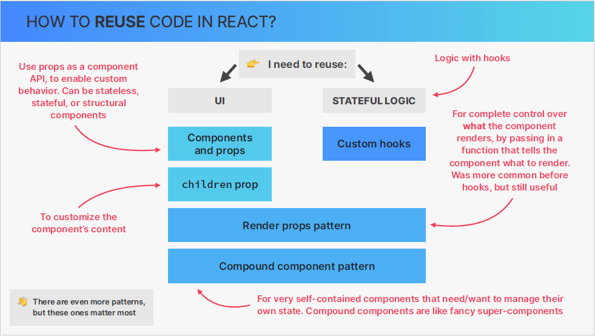

## Advanced React Patterns

used by seniors react developers in the most professional code basis.

in particular, you're gonna learn about the render props patterns, higher-order components and (the compound component pattern)

and we're gonna use to build a few incredible components for our project such as reusable model window and a context menu.

Now, this section will feel really advanced, specially towards the end of it.

## An Overview of Reusability in react

this section is about reusability to make components reusable and flexible so since this part about reusability let's now take an overview of how we can reuse different types of code in React,,
and how these advanced patterns fit into the picture.

