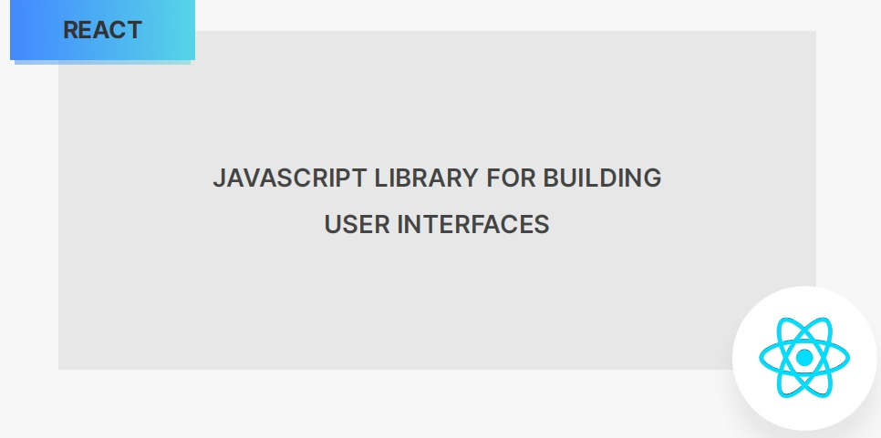
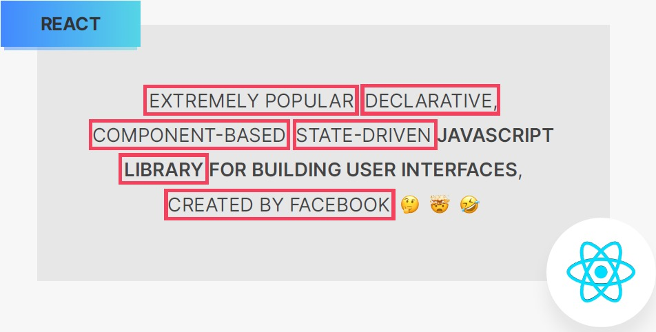
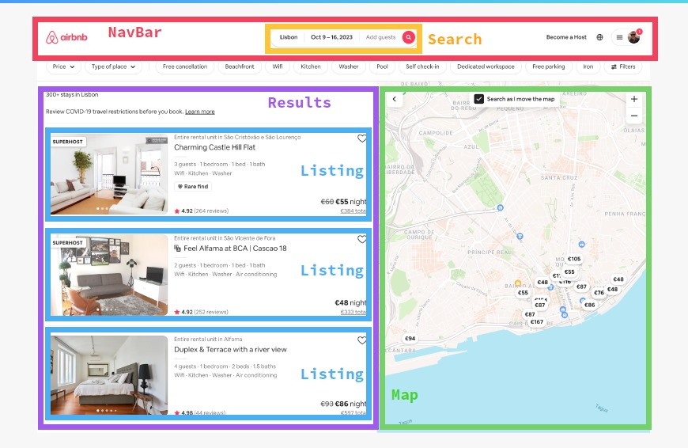
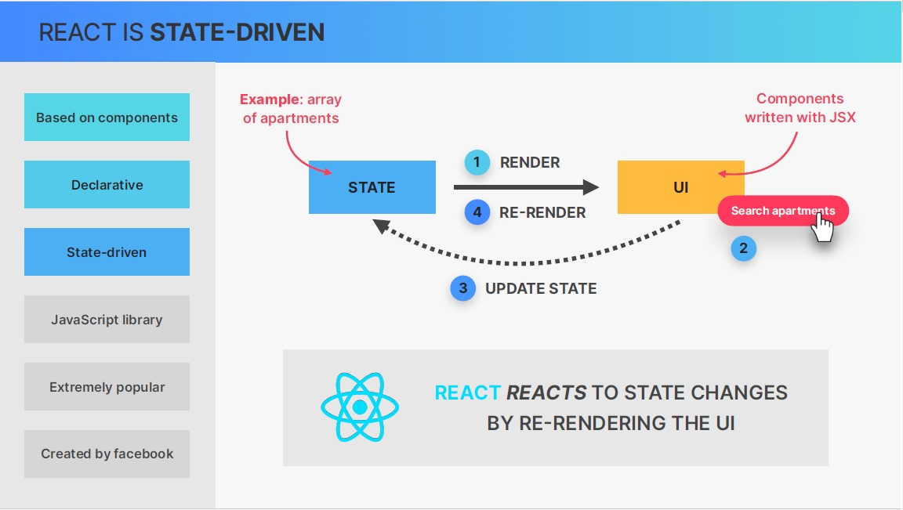
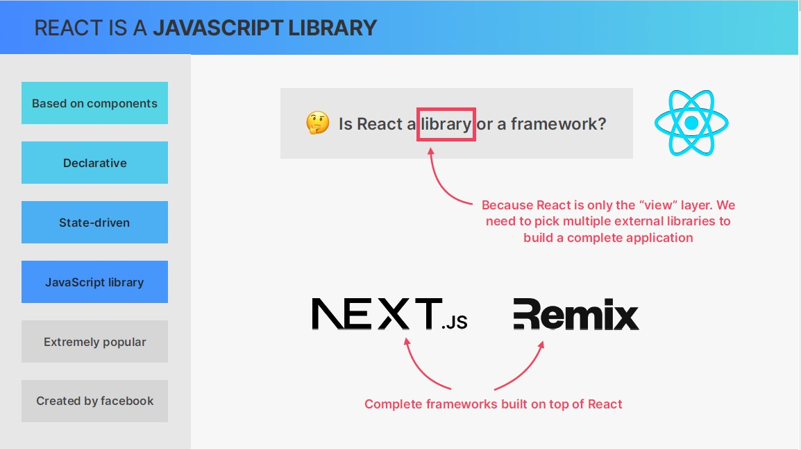
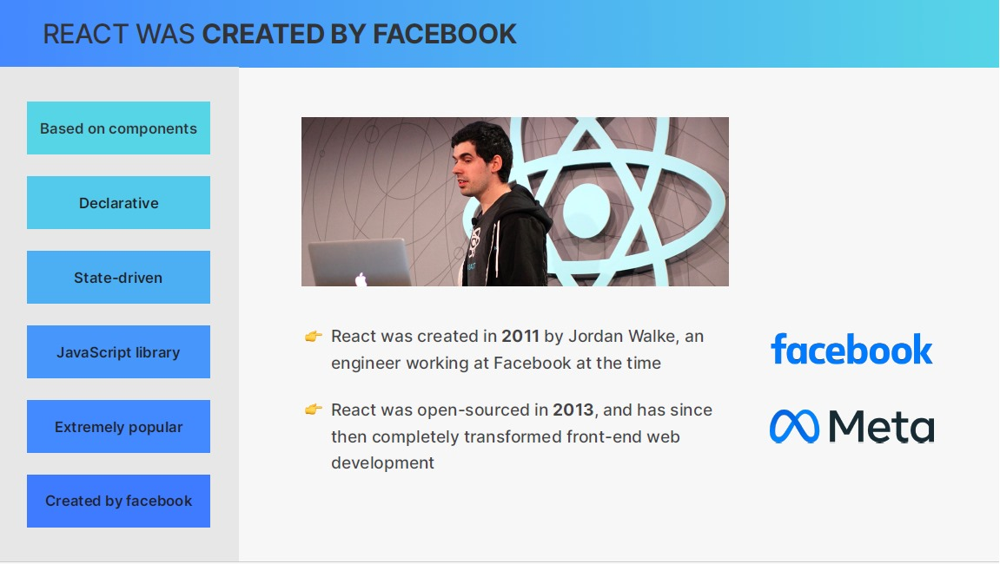

## (1) Why react

#### (a) How websites were built in the past ? How we transitioned to the new way ? How that lead to the rise of frontend frameworks ?

Before 2010 , all websites are rendered by the server (Server side rendering)

A resulting HTML, CSS and javascript from the server is sent to the client side and painted on the web page by browsers

An Example: Wordpress

javascript is included in these pages to add simple dynamics to the page, add some animations and somthing like that.
And usually a very popular library at the time called jQuery was used for this because it makes javascript work the exact same way across all browser back then.

However, overtime developers started writing more and more javascript code to be excuted by the browser, until at some point these became fully fledged web applications which then led to the rise of so called single page applications.

so these are basically webpages that are rendered on the client side not the server.
so it shifted from the server to the client.

so now we don't call these webpages anymore but instead web applications.
now this web application needs to use the data which usually come from backend in the form of an API.

these spa feels that you are using a native desktop or mobile application.so you can click on links or submit forms without the page ever reloading. so you're technically on the same page and therefore it's calles single page application.

But Server side rendering is actually making a comeback right now. so it's slowly getting modern again driven by frameworks that are given by the top of the modern client side rendering frameworks such as Nextjs, Remix and others.

##### (b) How do we build single page applications ?

we don't want to build it with vanilla javascript because there are actually several problems when we build large scale applications with vanilla js

- First Let's establish that any frontend application is about handling data then displaying that data in a nice user interface and user interface needs to stay in sync with the data and it's very hard problem to solve
  
  

1- Because it requires a large amount of direct DOM traversing and manipulation and this is guaranteed to become a absolute nightmare in complex applications because our code become extremly complex and hard to understand and we will probaly end up with the huge mess spagetti code

2-states (such as simple text or numbers) is usually stored in the DOM,so right in the HTML elements themselves rather than in central place in the application. and this make the spaggti code even harder to understand and even worse and it'll most certainly introduce many bugs into our application.

so at this point, you might as well just use
a battle tested framework like react.

##### (c) Why do frontend frameworks exist ?

## (2) React vs. vanilla js

To get the first feeling of how react keep user interface sync with state let's compare the advice app that we built in the first section with a vanilla js implementation and reactjs.

[codesandbox link](https://codesandbox.io/s/react-first-app-advice-52879f)

1- They have very different philosophy

2- every element in html you need to give it a class to select it by javascript while you don't need that with react

3- you select elements manually by js and give give them conntent manually but you don't need that in react

4- you might say this is small there is no need to react and this is true for small applications like this but as soon as we get just a little bit bigger it starts kind of getting out of control so you have to selecting tons of elements and updatign them manually and make a lot of code that with react we don't need this

## (3) what is react

- Abstraction and high level overview of react and how it works

1. what is react

   

   Let's extend this definition a little bit so that becomes more helpful
   

   

   

   

   the react app keeps the user interface sync with data now let's call data (state)

   
   and that is the whole reason why react called react in the first place (it reacts to state changes by rerendering the ui)

   

   

   

   

   React does all this by employing something called virtual dom, a fiber tree, one way data flow and many other techniques that we will study throughout this course

## (4) a new react apps

##### (a) setting up tools (vscode - nodejs - some extensions like(eslint - prettier - ....)) and adding some snippets

##### (b) pure react

##### (c) Quick look at react official documentation

##### (d) Setting up a new react project: The options

##### (e) Setting up a project with create react app

### (5) Questions

###### is vuejs client side rendering or server side

###### ChatGPT

- Vue.js is a JavaScript framework primarily designed for client-side rendering. This means that Vue.js applications run in the browser and generate the user interface on the client side. The browser downloads the necessary HTML, CSS, and JavaScript files and processes them to render the application.

- However, Vue.js can also be used for server-side rendering (SSR) through a separate package called "Nuxt.js." Nuxt.js is a framework built on top of Vue.js that allows you to create universal applications with server-side rendering. With Nuxt.js, you can choose whether to render pages on the server or in the client, depending on your application's requirements. Server-side rendering can improve performance and provide better search engine optimization (SEO) compared to purely client-side rendering.

###### angular, reactjs, vuejs lauched year

###### ChatGPT

Here are the launch years for Angular, React.js, and Vue.js:

Angular:

AngularJS (Angular 1): Released in 2010.
Angular (Angular 2 and subsequent versions): Angular 2 was released in 2016.
React.js:

React.js: Initially released in 2013.
Vue.js:

Vue.js: Initially released in 2014.
These frameworks and libraries have since evolved, with new versions and updates being released regularly to enhance functionality, performance, and developer experience. Keep in mind that the information provided here reflects the initial release years of these technologies.
