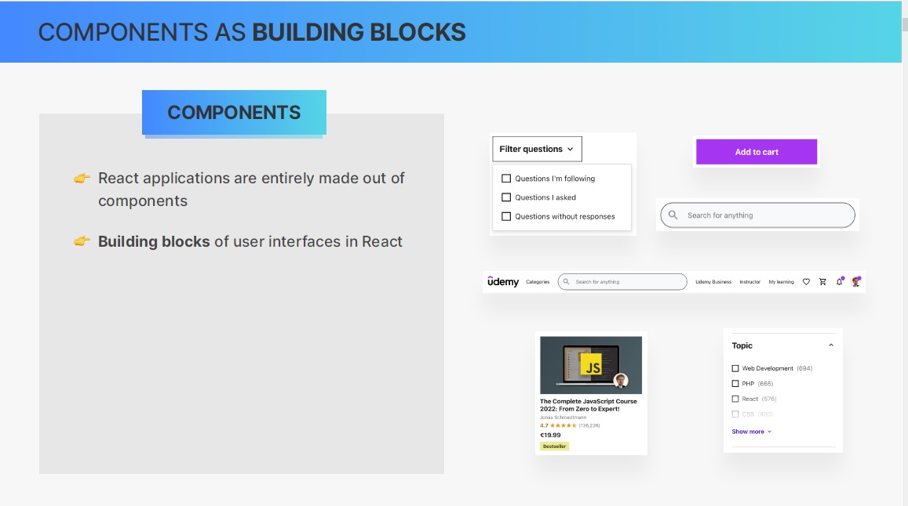
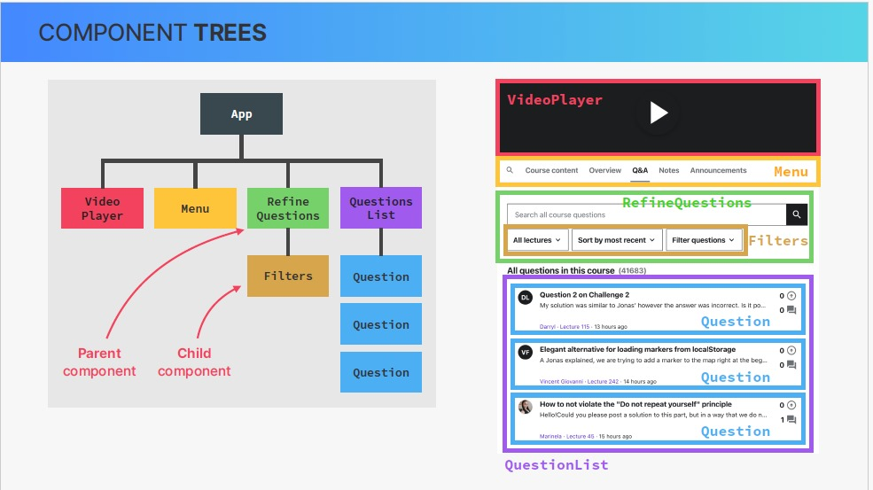
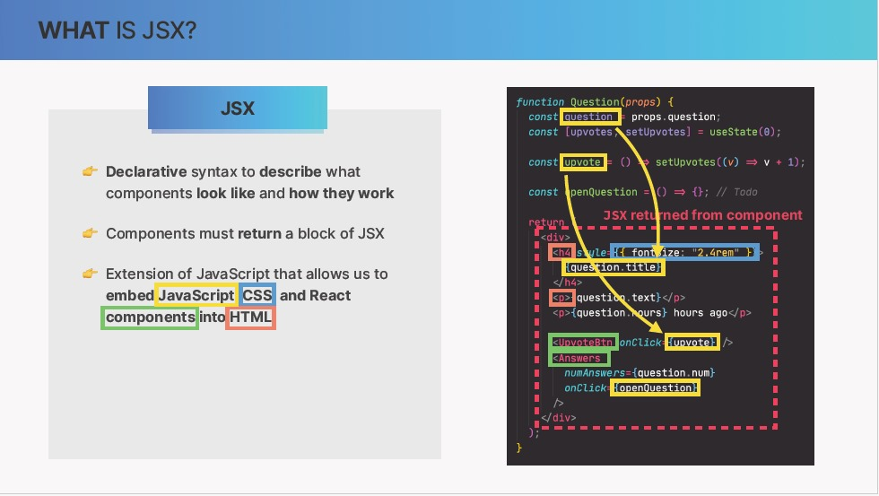
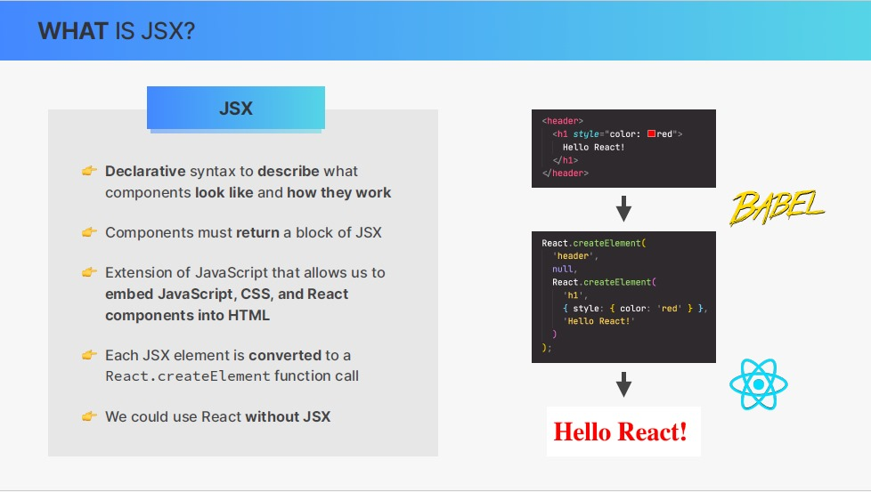
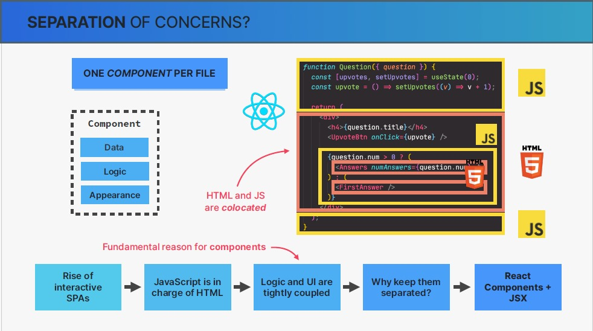
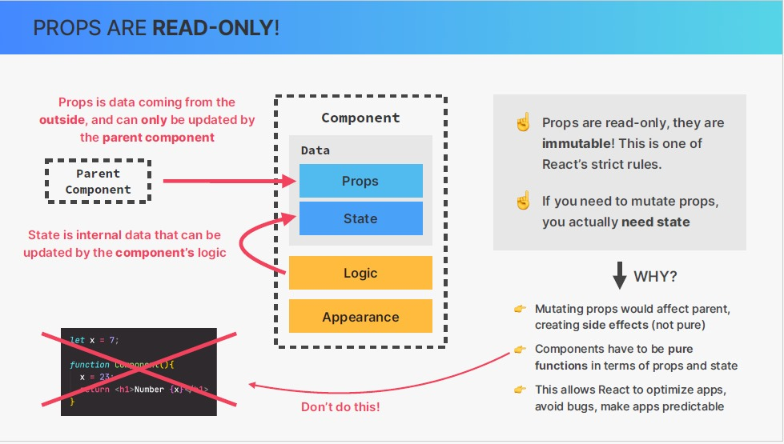

# Components as building blocks

# what is jsx

# Separation of concerns

- we're going in the fact that jsx combines HTML,CSS, and javascript into one single block of code
- you might be wondering why did react come up with this idea in the first place
- why didn't it keep HTML,CSS, and javascript in separate places, like we have alwayes done before

- let's take it from the beginning

before spa there was one file for HTML , one for css and one for js so basically one technology per file. That was our traditional separation of concerns.

as pages got more and more interactive they became single page applications. where js started to determine the user interface and the content in general.
Or in other words js became more and more in charge of the HTML as in this example

HTML elements are really completely determined by js. So they are in fact tightly coupled together.
So the HTML doesn't make sense without javascript here.

So why we should keep them separated in these different files and in different code blocks
so the answer is what gave us react components and jsx.

the same is actually also true for most other modern front-end frameworks.

# Props

is the way to pass data between components

- we use props to pass data from parent component to child component

