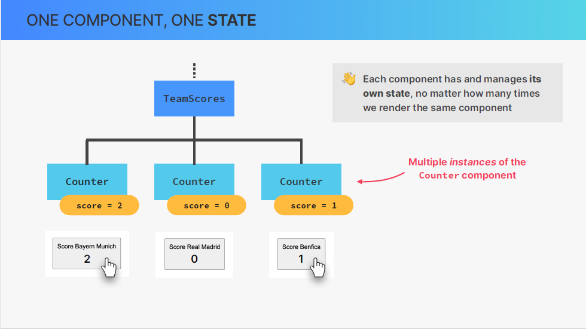
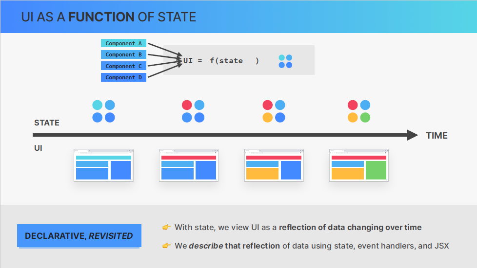

# overview

In this section we will make our components interactive. So to do that we will start learning how to handle events in react and how to update the user interface using extremly important concept of state.

We'll also start building the next project where we are going to focus on state and on building forms in the React way using controlled element

# difference between function and function call

```
onClick={alert("something")} => this will execute the function once it starts execute the function component
```

but

```
onClick=(() => alert("something")) this will execute after clicking <the event>
```

so when we declare the function first we just call the value not the function itself

```
function handleSomething() {
    alert("something");
}

in jsx

<button onClick={handleSomething}>Hanlde</button>
or
<button onClick={() => hanldeSomething}>Handle</button>
but the second approach is very redundent so we use the first one

```

# States

- without doubt state is the most important concept in react. So everything basically revolves around state in React.

## What state actually is ?

1- it is basically data that a component can hold over time, and we use it for information that a component needs to remember throughout its lifecycle.
Therefore, we can think of state as being the memory of the component.
examples


what all these pieces of state have in common is that in the application, the user can easily change these values.
for example, when they read a notification, the count will go down by one, or when they click on another tab, this tab will become active.
And therefore each of these components needs to hold data over time, so over the lifecycle of the application.

so that pieces of information is a (piece of state)


2- let's now move on to the most important aspect of state.
which is the fact that updating state triggers the React to re-render the component.
again whenever we update a piece of state in a component that make react re-render this component in the user interface.
So it will create a new updated view for that component.
And a component's view is basically just the component visually rendered on the screen, so in the user interface.
we talk about single component a part of user interface and we call it a view.
and when views combined together, then make up the final user interface.

remember! state is how react keeps the user interface in sync with data. we change the state, we change the ui.


## few things about the state

useState called a hook in react. we identify hook because we start with use keyword.
so useEffect, useReducer, useCallback are react hooks. we will talk more about that later.

But now you need to know is that we can only call hooks like useState on the top level of the function.
not inside if statement or inside another function or inside a loop.
Another thing => is that we should only update the state using setter function not manually.

```
function App(){

    // this is where you call hooks in react (this is the top level of the function)

    return (
        // jsx
    )
}
```

## some bad practices

React is immutable so don't update the state manually

```
function App(){
    let [step,setStep] = useState(1);
    let [test,setTest] = useState({name:"mahmoud"});


    function handleStep(){
        // set step manually this is the bad practice and will not update in the browser because react has no way to know this is for updating the step therefor it provided us with useState so you must update it with setStep
        step = step + 1;
    }
    function handleTest(){
        // this will re-render the ui and work correctly but this is the bad practice and you should never do it because this is not react concept
        test.name = "ali";
        setTest({name:"ali"}) // GOOD PRACTICE
    }
    return (
        <>
            <button onClick={handleStep}>HANDLE</button>
        </>
    )
}
```

## The Mechanics of state in react

- Remember that we learned in react that we don't manipulate the DOM directly when we want update the components view. So react is declarative, not imperative.
  So if that the case how do we update the component on the screen whenever some data changes or whenever we need to respond to some event like a click ?
  Now, we already know that the answer of this question is (state).
  but we are trying to derive it from first principles.
  we need to understand another fundamental React principle, which is the fact that React updates a component view by re-rendering the entire component whenever the underlying data changes.

  for now, just now re-rendering basically means that react calls the component function again, so each time the component is rendered.
  So conceptually we can imagine this as React removing the entire view and replacing it with a new one each time a re-render needs to happen.

  Now, React preserves the component state throughout re-renders, and so even though a component can be re-rendered time and time again, the state will not be reset (unless) the component disappears from the UI entirely, which is what we call unmounting.

  

  

  

  

# Demo of the first app

[link on codesandbox](https://rvvdc5.csb.app/)

# update state based on the current state

```
const [step, setStep] = useState(false);

function handler(){
    setStep((prev) => !prev) // you pass a function into setter function taking an argument of previous state value and the body of the function is the new value
}
```

# a few more important thoughts about state

1- each component really has, manages its own state even if we render the same component multiple times on one page, each of these component instances will operate independently from all the other ones.
example



so state really is isolated inside of each component.

Now, if we analyze everything that we just learned about state, we can come to the conclusion that we can basically think of the entire application view, so the entire user interface, as a function of state.
Or in other words, the entire UI is always a representation of all the current states in all components.
And, taking this idea even one step further, a react application is all about changing state over time, and of course, also correctly displaying that state at all times. And this is really what the declerative approach to building user interfaces is all about.

So, instead of viewing a UI as explicit DOM manipulations, with state, we now view a UI as a reflection of data changing over time.
Reflection of data using state, jsx, event handlers.

So, we describe the UI, React does the rest.



Now this might be sound a lit philosophical at this point but as you become more and more experience in building react apps and working with state.

# A few guidelines on how to useState in practice


finally there is one common mistake that many beginners make which is to use state for every single variable they need in the component but that really is not necessary. so, don't use state for variables that should not trigger a re-render because that will just cause unneccearry re-renders which can cause performance issues so it's very common to need some varibales that are not state. so for those, you can choose regular varibales such as const, let,..
