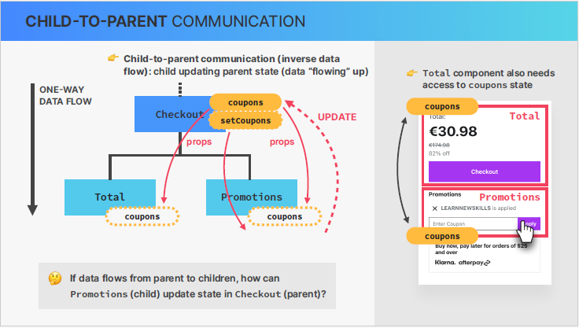
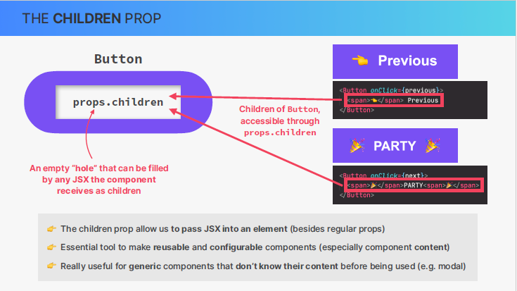

# Overview

Thinking in react encompasses many different aspects but in this section we will focus on state management. So you will learn when and where to create state variable, when and how to derive state, and also how to communicate between child and parent components by lifting state up.

And all of these skills will be needed as we keep building our far away application.

# What is thinking in React ?

Building react application requires a completely new mindset because it's just very different from building application with vanilla javascript.

So to build react apps you not only need to learn how to work with the react api in practice like with all the different functions like useState but you also need to be thinking in React. So you need to basically enter the React mindset.

Now, once you have both of these skills, you will have mastered react and you will be well on your way to building professional React applications.


- Now, What does thinking in react actually mean ?

while you're building an application, thinking in react means that you have a very good mental model of how and when to use all the react tools like components, state, props, general data flow, effects.

It's also about always thinking in terms of state transitions rather than in element mutations as we have learned before.


👆 1- this also includes thinking about reusability and composability of components.

the points 3, and 4 is what we collectively call state mangement, which is the main focus of this section.

# Fundamental of State Mangement

We've learned before that state is the most important concept in react therefore, managing state is the most important aspect when it comes to thinking in react

analyze this picture that has multiple pieces of state


Now, all this looks like a bit of a mess.
like how do we know that we even need all these pieces of state ?
how do we know where exactly to place them inside the code ?
well that's where state mangement comes into play.

it can be defined in different ways by different people. but we agree with the definition in the picture above 👆

in our small apps we never had to worry about state mangement at all. we simply place each state in the component that needed it. But as the app grows, the need to find right home for each piece of state becomes really important, no matter if that home is the component where we first need that state, some parent component or even global state.

### Difference between two type of state ( local and global state )


### When and where we should use state ?


# Thinking about state and Lifting state up

if the sibling component wants the props so you can't pass props to it because it is not the child so you need to lift the state up to the parent and the function that setState you will pass it to the first component and the data to the second component

### Reviewing "Lifting up state"

Let's now look at example and some diagrams to really understand how it works and why it is so important.

As an example let's use checkout part of udemy interface




we started with promotion component where the user can input coupon codes that will then be added to a list of applied component so it sounds like we need code of coupons right here so that coupon state is now local in the promotion component.
next we set out to build Total component but here we also realize that the Total component also needs to access the coupon state.
Otherwise, without knowing which coupons have to been applied, how would the total component know, what discounts to apply, and what price to display ? and so here we encounter a problem.
How do we give the total component access to the coupon state because in react we have one way data flow, so data can only flow down from parent to child not sibling. therefore we can't pass a prop from a component to sibling component. So we need to share the state betweeen the components that further up or sideaway in the component tree. (Lifting it up) But what does that mean, and how exactly does it work ?

##### Lifting state up simply means to place some state in the component that is a parent of both components that need the piece of state in question

- so in this example we place the state in the Checkout component instead of promotion component and then give the both children components access to the state passing it down as props.

- and if we want to update the state (was in the promotion component but now in checkout component) simply pass setState as a prop in this component and update it. ( we can call this technique <inverse date flow> or <Child to Parent Communicatoin>)

- Note :- it's not truly passing up but just passing down a setter function and use it to update the parent state

- Simply review this graph one more time.

## Deriving state


## challenge #1 (Accordion component)

[live demo and source code on codesandbox](https://codesandbox.io/p/sandbox/white-fog-6n47rx)

## The children prop

it is a prop that each react component auto receives. and the value of the children prop is exactly what is between opening and closing tag of the parent component. See the step challenge example
[the example](./steps/src/App.tsx)

with this we gain a new important tool, that makes our component really reusable.

to recap



---

# Questions

#### user

- what is type never in typescript

#### ChatGPT

In TypeScript, the never type represents a value that will never occur. It is often used in scenarios where a function is expected to throw an exception, loop indefinitely, or have some other behavior that prevents it from returning a normal value.

Here are a few common use cases for the never type:

Functions That Always Throw:

typescript

```
function throwError(message: string): never {
throw new Error(message);
}
```

Infinite Loops:

typescript

```
function infiniteLoop(): never {
while (true) {
// Do something indefinitely
}
}
```

Type Guards:
The never type is often used in type guards to represent cases that should never happen. For example, if you have narrowed down the type of a variable in all possible branches, TypeScript can infer the type as never in an unreachable code path.

typescript
Copy code

```
function exampleTypeGuard(value: string | number): string {
if (typeof value === "string") {
return value;
} else if (typeof value === "number") {
return value.toFixed(2);
} else {
// In this branch, TypeScript knows that value can never be a string or number
// This function will never return, so its return type is 'never'
throw new Error("Unexpected type!");
}
}
```

Unreachable Code:
If TypeScript determines that a code path is unreachable, it may infer the type as never.

typescript

```
function unreachableCode(flag: boolean): string {
if (flag) {
return "Flag is true";
} else {
throw new Error("This code path is unreachable");
}
}
```

Using never can be a way to help TypeScript understand the control flow in your code and make more accurate type inferences. It is especially useful in situations where certain values or branches should never occur during runtime.
