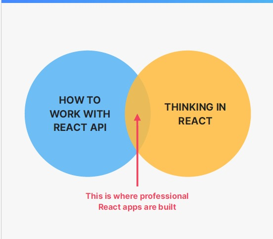
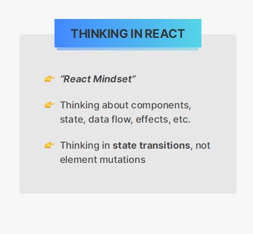
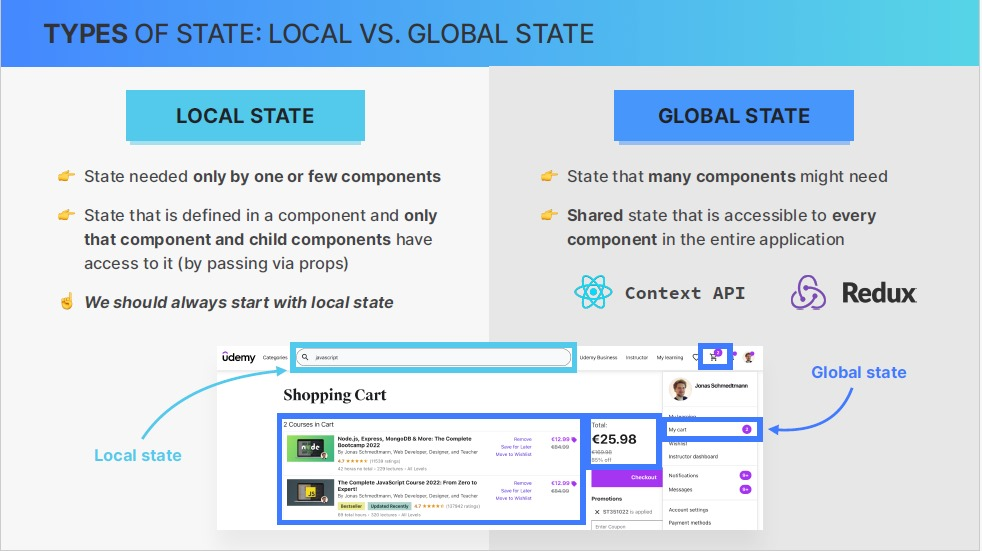

# Overview

Thinking in react encompasses many different aspects but in this section we will focus on state management. So you will learn when and where to create state variable, when and how to derive state, and also how to communicate between child and parent components by lifting state up.

And all of these skills will be needed as we keep building our far away application.

# What is thinking in React ?

Building react application requires a completely new mindset because it's just very different from building application with vanilla javascript.

So to build react apps you not only need to learn how to work with the react api in practice like with all the different functions like useState but you also need to be thinking in React. So you need to basically enter the React mindset.

Now, once you have both of these skills, you will have mastered react and you will be well on your way to building professional React applications.

- Now, What does thinking in react actually mean ?

while you're building an application, thinking in react means that you have a very good mental model of how and when to use all the react tools like components, state, props, general data flow, effects.

It's also about always thinking in terms of state transitions rather than in element mutations as we have learned before.

👆 1- this also includes thinking about reusability and composability of components.

the points 3, and 4 is what we collectively call state mangement, which is the main focus of this section.

# Fundamental of State Mangement

We've learned before that state is the most important concept in react therefore, managing state is the most important aspect when it comes to thinking in react

analyze this picture that has multiple pieces of state

Now, all this looks like a bit of a mess.
like how do we know that we even need all these pieces of state ?
how do we know where exactly to place them inside the code ?
well that's where state mangement comes into play.

it can be defined in different ways by different people. but we agree with the definition in the picture above 👆

in our small apps we never had to worry about state mangement at all. we simply place each state in the component that needed it. But as the app grows, the need to find right home for each piece of state becomes really important, no matter if that home is the component where we first need that state, some parent component or even global state.

### Difference between two type of state ( local and global state )

### When and where we should use state ?

